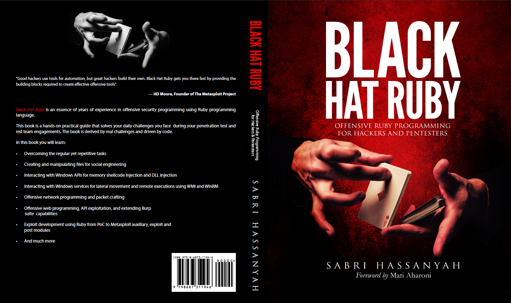

# Module 0x0 \| Introduction

  
_**Rubyfu, where Ruby goes evil!**_  

## Introduction

This book is a great collection of ideas, tricks, and skills that could be useful for Hackers. It's a unique extraction reference, summarizes a lot of research and experience in order to achieve your **w00t** in the shortest and smartest way. Rubyfu is where you'll find plug-n-hack code. Rubyfu is a book to use not only to read, it's where ruby goes evil.

### Who should read this book?

Ideally, Hackers! Those who have enough experience to hack our world and have _at least_ basics in the Ruby programming language. To get the best benefits of the book, open Rubyfu.net and pin its browser tab. Use the irb/pry interactive interpreter to run the code, or run it as a script. Enhance the code to fit your needs and yeah, tweet the code and its output to [@Rubyfu](https://twitter.com/rubyfu) to share it with our awesome community.

### Organization of the book

#### Module 0x0 \| [Introduction](./)

Module 0x0 is just a smooth start for you, whether you're a reader, writer, hacker or someone who came to say hi. In this module you'll find a great start for you as a contributor, where all kinds of contributions are welcome starting from proofreading all the way up to topic writing.

#### Module 0x1 \| [Basic Ruby Kung Fu](module-0x1-or-basic-ruby-kung-fu/)

Module 0x1 is an awesome collection of the most commonly needed string manipulation, extraction and conversion tasks; dealing with real cases that you might face during your hack. Your encoding and data conversion may be a trivial or complex challenge and here we don't care, we'll solve it.

#### Module 0x2 \| [System Kung Fu](module-0x2-or-system-kung-fu/)

Module 0x2 digs more into system hacking, where system commands, file manipulation, cryptography and generating common hashes are often needed. Getting simple bind and reverse shells with Ruby is a useful skill, no doubt. Almost all mainstream Linux systems are shipped with ruby and if not, no problem, we always have other ways to make use of our knowledge.

#### Module 0x3 \| [Network Kung Fu](module-0x3-or-network-kung-fu/)

Module 0x3 dives deeper into network sockets, protocols, packet manipulation, service enumeration and gives us more hacky and awesome code to get the job done. Working with network protocols needs a deeper knowledge of how these protocols work in order to exchange understandable data and yeah, we'll figure it out right here.

#### Module 0x4 \| [Web Kung Fu](module-0x4-or-web-kung-fu/)

Module 0x4 covers web topics. The web is the most common place to share information, making it one of the most delicious places to hack. Web hacking challenges, known for their uniqueness and with many potential technologies within a single page, require a versatile tool with easily adaptable capabilities. Here we'll learn how to deal with GET & POST requests, web services, databases, APIs and manipulating the browser to make it our soldier.

#### Module 0x5 \| [Exploitation Kung Fu](module-0x5-or-exploitation-kung-fu/)

Module 0x5 builds your exploitation abilities with Ruby. Whatever the vulnerability may be, remote \(FTP, IMAP, SMTP, etc.\) or local \(file format, local system\) you'll need to know how to build fuzzers and skeleton exploits for it. If you get there you'll need a simple, clean and stable way to build your exploit. Here you'll learn how to build your fuzzer, exploit, and port your exploit to Metasploit -- and even how to write your own Metasploit modules too.

#### Module 0x6 \| [Forensic Kung Fu](module-0x6-or-forensic-kung-fu/)

Module 0x6 explores forensic capabilities with Rubyfu. Whoever you are: redteam, blueteam, or in-between you'll need some forensic skills in your hack and/or investigation. Here you'll learn more about how to deal with registry tasks, extracting browser information, and much more.

## Black Hat Ruby **— Offensive Ruby programming book for hackers & pentesters**

Black Hat Ruby is the commercial edition of Rubyfu. The book contains many new topics and solving a lot of real-world challenges with detailed explanations targeting professionals.


You can purchase [**Black Hat Ruby on Amazon**](https://www.amazon.com/dp/B08JHSF6GT)\*\*\*\*


The primary goal of Black Hat Ruby book is to provide you with a vast angle of using Ruby as an information security professional in an offensive manner. The book meant to help you with weaponizing Ruby language in various offensive scenarios whether you are testing web applications, networks, systems, or exploit development to carve your ideas into working and achieving code.

Another intended goal of the book is to route you to the code that achieves your goal in the shortest time. This book is aimed at security researchers, security consultants, penetration testers, red teamers, or any professional who is interested in writing offensive Code.

In this book, you will learn: 

* Hacker's day to day string manipulation, conversion, and extraction. 
* Compiling ruby to exe, parsing, and files such as XML, JSON, HTML, and binary. 
* Manipulating files stamps, creating malicious Shortcut, Excel & PDF files. 
* Generating the most common hashes for various platforms. 
* Using ruby to execute system commands. 
* Tactical code for red teaming activities, such as lateral movements via WinRM, WMI and creating malicious OLE and malicious Excel files for spear phishing. 
* Importing Windows system internal for execute shellcode, dll injection. 
* Introduction to the network Socket operations in Ruby and creating a remote shell. 
* Malicious use for network services such as HTTP, SSH, DNS, FTP, TFTP for exploitation and data exfiltration. 
* Packet manipulation and building network packet from the ground up to for ARP spoofing, rogue wireless access point \(AP\), SNMP spoofing and parsing captured pcap files. 
* Introduction about dealing with services and creating covert C2 for data exfiltration. 
* Automating the hunting of XSS and blind-XSS. • Exploiting Web socket and WSDL services and its APIs. 
* Using Slack as a C2 
* Understanding and creating advanced Burp Suite scanner extensions \(active and passive\) and manipulate the Burp user interface in detail. 
* Step by step basic buffer overflow exploit development using ruby. 
* Porting your stand-alone exploit to Metasploit and creating Auxiliary, Exploit and Post modules.

Happy Hacking!

