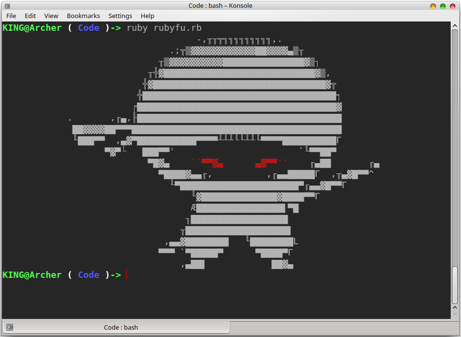

# RubyFu

***RubyFu is where Ruby goes evil!*** 

This book is a collection of ideas, tricks and skills that could be useful for Hackers. It's a unique reference summarizes a lot of re-search and experience in order to achieve your **w00t** in shortest and smartest way.

### Who should read this book?
Ideally, Hackers!

### Organization of the book
##### Module 0x1 | Basic Ruby KungFu
##### Module 0x2 | System KungFu
##### Module 0x3 | Network KungFu
##### Module 0x4 | Web KungFu
##### Module 0x5 | Exploitation KungFu
##### Module 0x6 | Reverse Engineering KungFu

