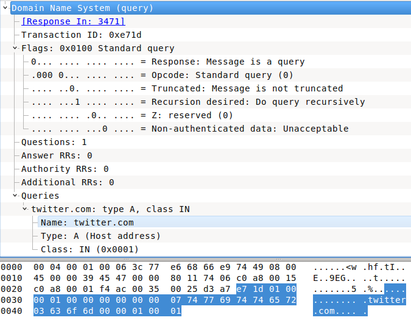

# DNS Spoofing
Continuing our attack through [ARP Spoofing](module_0x4__network_kungfu/arp_spoofing.md), we want to change the victim's DNS request to whateven distination we like.

### Scenario
```
                |Attacker|
                    | AttackerSite
                    ٧                      AttackerSite
|Victim| ----------/ \----------> |Router| ----------> Internet
          AnySite      AttackerSite
```
> Keep the ARP spoof attack running

The same IPs of ARP spoof attack

| Host        |   IP Address  |
|:-----------:|:-------------:|
| Attacker    | 192.168.0.100 |
| Victim      | 192.168.0.21  |
| Router      | 192.168.0.1   |


Now we cant intercept DNS Query packet comming from victim's machine. Since PacketFu supports filters in capturing (to reduce mount of captured packets) we'll use `udp and port 53 and src` filter, then we'll inspect the captured packet to ensure that it's a query then find the requested domain..........

From wireshark, if we take a deeper look at the DNS query payload in `Domain Name System (query)`, we can see its been presented in hexdecimal format.

|  |
|:---------------:|
| **Figure 1.** DNS query Payload  |


Let's to anatomize our payload
```
0000   e7 1d 01 00 00 01 00 00 00 00 00 00 07 74 77 69
0010   74 74 65 72 03 63 6f 6d 00 00 01 00 01
```
* The First 2 bytes is the **Transaction ID**. (Our case: `\xe7\x1d`)
* The Nex 2 bytes is the **Flags**[^3]. (Our case: `\x01\x00` = \x10)
* Farthermore, in **Queries** section which contains
```
0000   07 74 77 69 74 74 65 72 03 63 6f 6d 00 00 01 00
0010   01
```
    * The **Queries** starts at *13 byte* of the payload.
        * The13th byte specifies the length of the domain name *before* the dot com. (Our canse: `\x07`)
        **Try:**`[%w{ 74 77 69 74 74 65 72 }.join].pack("H*")`
        * The dot in front of the com is epresented by a `\x03`.
        * The end of the domain name string is terminated by a `\x00`.
        **Try:** `[%w{ 74 77 69 74 74 65 72 03 63 6f 6d }.join].pack("H*")`
    * The next 2 bytes refers to the **type of the query**[^4]. (Our canse: `\x00\x01`)


```ruby

```


Source[^1] [^2]

[^2]http://crushbeercrushcode.org/2012/10/ruby-dns-spoofing-using-packetfu/
http://tuftsdev.github.io/DefenseOfTheDarkArts/assignments/manipulatingthenetworkwithpacketfu-110314111058-phpapp01.pdf

<br><br>
---
[^1]: [DNS Spoofing Using PacketFu](http://crushbeercrushcode.org/2012/10/ruby-dns-spoofing-using-packetfu/)
[^2]: [Manipulating The Network with PacketFu](http://tuftsdev.github.io/DefenseOfTheDarkArts/assignments/manipulatingthenetworkwithpacketfu-110314111058-phpapp01.pdf)
[^3]: [DNS Header Flags](http://www.iana.org/assignments/dns-parameters/dns-parameters.xhtml#dns-parameters-12)
|   Bit  | Flag | Description          | Reference |
|:------:|------|----------------------|-----------|
| bit 5  |      | Authoritative Answer | [RFC1035] |
| bit 6  |      | Truncated Response   | [RFC1035] |
| bit 7  |      | Recursion Desired    | [RFC1035] |
| bit 8  |      | Recursion Allowed    | [RFC1035] |
| bit 9  |      | Reserved             |           |
| bit 10 |      | Authentic Data       | [RFC4035] |
| bit 11 |      | Checking Disabled    | [RFC4035] |
[^4]: [DNS Lookups Types](http://www.iana.org/assignments/dns-parameters/dns-parameters.xhtml#dns-parameters-4)
|  Type | Value |               Description               |
|:-----:|:-----:|:---------------------------------------:|
| A     | 1     | IP Address                              |
| NS    | 2     | Name Server                             |
| CNAME | 5     | Alias of a domain name                  |
| PTR   | 12    | Reverse DNS Lookup using the IP Address |
| HINFO | 13    | Host Information                        |
| MX    | 15    | MX Record                               |
| AXFR  | 252   | Request for Zone Transfer               |
| ANY   | 255   | Request for All Records                 |
