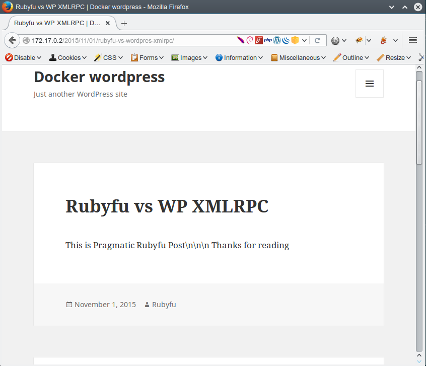

# Wordpress API

Ruby has a [standard library][2] called `xmlrpc` which take care of all xmlrpc stuff you can even create an xmlrpc server using it. Let's  to get  Some real word example 

Looking for really known application that support XMLRPC then of course Wordpress was the first attendee. 

So what do we want to do?
- Say hello to wordpress 
- List all available methods
- List all available users
- List all available post
- Create a new post!
- Retrieve our created post
- List all comments on our created post


```ruby
require 'xmlrpc/client'

opts =
    {
        host: '172.17.0.2',
        path: '/xmlrpc.php',
        port: 80,
        proxy_host: nil,
        proxy_port: nil,
        user: 'admin',
        password: '123123',
        use_ssl: false,
        timeout: 30
    }

# Create a new instance 
server = XMLRPC::Client.new(
    opts[:host], opts[:path], opts[:port],
    opts[:proxy_host], opts[:proxy_port],
    opts[:user], opts[:password],
    opts[:use_ssl], opts[:timeout]
)

# Create a new instance takes a hash
server = XMLRPC::Client.new3(opts)

# Say hello to wordpress
response = server.call("demo.sayHello")

# List all available methods
server.call('system.listMethods', 0)

# List all available users
server.call('wp.getAuthors', 0, opts[:user], opts[:password])

# List all available post
response = server.call('wp.getPosts', 0, opts[:user], opts[:password])

# Create a new post!
post =
    {
        "post_title"     => 'Rubyfu vs WP XMLRPC',
        "post_name"      => 'Rubyfu vs Wordpres XMLRPC',
        "post_content"   => 'This is Pragmatic Rubyfu Post. Thanks for reading',
        "post_author"    => 2,
        "post_status"    => 'publish',
        "comment_status" => 'open'
    }
response = server.call("wp.newPost", 0, opts[:user], opts[:password], post)

# Retrieve created post
response =  server.call('wp.getPosts', 0, opts[:user], opts[:password], {"post_type" => "post", "post_status" => "published", "number" => "2", "offset" => "2"})

# List all comments on a specific post
response =  server.call('wp.getComments', 0, opts[:user], opts[:password], {"post_id" => 4})

```

Results 

```ruby
>> # Say hello to wordpress
>> response = server.call("demo.sayHello")
=> "Hello!"
>> 
>> # List all available methods
>> server.call('system.listMethods', 0)
=> ["system.multicall",
 "system.listMethods",
 "system.getCapabilities",
 "demo.addTwoNumbers",
 "demo.sayHello",
 "pingback.extensions.getPingbacks",
 "pingback.ping",
 "mt.publishPost",
 "mt.getTrackbackPings",
 "mt.supportedTextFilters",
 "mt.supportedMethods",
 "mt.setPostCategories",
 "mt.getPostCategories",
 "mt.getRecentPostTitles",
 "mt.getCategoryList",
 "metaWeblog.getUsersBlogs",
 "metaWeblog.deletePost",
 "metaWeblog.newMediaObject",
 "metaWeblog.getCategories",
 "metaWeblog.getRecentPosts",
 "metaWeblog.getPost",
 "metaWeblog.editPost",
 "metaWeblog.newPost",
 ...skipping...
 "blogger.deletePost",
 "blogger.editPost",
 "blogger.newPost",
 "blogger.getRecentPosts",
 "blogger.getPost",
 "blogger.getUserInfo",
 "blogger.getUsersBlogs",
 "wp.restoreRevision",
 "wp.getRevisions",
 "wp.getPostTypes",
 "wp.getPostType",
 "wp.getPostFormats",
 "wp.getMediaLibrary",
 "wp.getMediaItem",
 "wp.getCommentStatusList",
 "wp.newComment",
 "wp.editComment",
 "wp.deleteComment",
 "wp.getPost",
 "wp.deletePost",
 "wp.editPost",
 "wp.newPost",
 "wp.getUsersBlogs"]
>> 
>> # List all available users
>> server.call('wp.getAuthors', 0, opts[:user], opts[:password])
=> [{"user_id"=>"1", "user_login"=>"admin", "display_name"=>"admin"}, {"user_id"=>"3", "user_login"=>"galaxy", "display_name"=>"Galaxy"}, {"user_id"=>"2", "user_login"=>"Rubyfu", "display_name"=>"Rubyfu"}]
>> 
>> # List all available post
>> response = server.call('wp.getPosts', 0, opts[:user], opts[:password])
=> [{"post_id"=>"4",
  "post_title"=>"Rubyfu vs WP XMLRPC",
  "post_date"=>#<XMLRPC::DateTime:0x0000000227f3b0 @day=1, @hour=19, @min=44, @month=11, @sec=31, @year=2015>,
  "post_date_gmt"=>#<XMLRPC::DateTime:0x0000000227d178 @day=1, @hour=19, @min=44, @month=11, @sec=31, @year=2015>,
  "post_modified"=>#<XMLRPC::DateTime:0x000000021d6ee0 @day=1, @hour=19, @min=52, @month=11, @sec=25, @year=2015>,
  "post_modified_gmt"=>#<XMLRPC::DateTime:0x000000021d4ca8 @day=1, @hour=19, @min=52, @month=11, @sec=25, @year=2015>,
  "post_status"=>"publish",
  "post_type"=>"post",
  "post_name"=>"rubyfu-vs-wordpres-xmlrpc",
  "post_author"=>"2",
  "post_password"=>"",
  "post_excerpt"=>"",
  "post_content"=>"This is Pragmatic Rubyfu Post. Thanks for reading",
  "post_parent"=>"0",
  "post_mime_type"=>"",
  "link"=>"http://172.17.0.2/2015/11/01/rubyfu-vs-wordpres-xmlrpc/",
  "guid"=>"http://172.17.0.2/?p=4",
  "menu_order"=>0,
  "comment_status"=>"open",
  "ping_status"=>"open",
  "sticky"=>false,
  "post_thumbnail"=>[],
  "post_format"=>"standard",
  "terms"=>
   [{"term_id"=>"1", "name"=>"Uncategorized", "slug"=>"uncategorized", "term_group"=>"0", "term_taxonomy_id"=>"1", "taxonomy"=>"category", "description"=>"", "parent"=>"0", "count"=>2, "filter"=>"raw"}],
  "custom_fields"=>[]},
 {"post_id"=>"1",
  "post_title"=>"Hello world!",
  "post_date"=>#<XMLRPC::DateTime:0x00000002735580 @day=1, @hour=17, @min=54, @month=11, @sec=14, @year=2015>,
  "post_date_gmt"=>#<XMLRPC::DateTime:0x0000000226b130 @day=1, @hour=17, @min=54, @month=11, @sec=14, @year=2015>,
  "post_modified"=>#<XMLRPC::DateTime:0x00000002268de0 @day=1, @hour=17, @min=54, @month=11, @sec=14, @year=2015>,
  "post_modified_gmt"=>#<XMLRPC::DateTime:0x000000021aea58 @day=1, @hour=17, @min=54, @month=11, @sec=14, @year=2015>,
  "post_status"=>"publish",
  "post_type"=>"post",
  "post_name"=>"hello-world",
  "post_author"=>"1",
  "post_password"=>"",
  "post_excerpt"=>"",
  "post_content"=>"Welcome to WordPress. This is your first post. Edit or delete it, then start writing!",
  "post_parent"=>"0",
  "post_mime_type"=>"",
  "link"=>"http://172.17.0.2/2015/11/01/hello-world/",
  "guid"=>"http://172.17.0.2/?p=1",
  "menu_order"=>0,
  "comment_status"=>"open",
  "ping_status"=>"open",
  "sticky"=>false,
  "post_thumbnail"=>[],
  "post_format"=>"standard",
  "terms"=>
   [{"term_id"=>"1", "name"=>"Uncategorized", "slug"=>"uncategorized", "term_group"=>"0", "term_taxonomy_id"=>"1", "taxonomy"=>"category", "description"=>"", "parent"=>"0", "count"=>2, "filter"=>"raw"}],
  "custom_fields"=>[]}]
>> 
>> # Create a new post!
>> post =
 | {    
 |   "post_title"     => 'Rubyfu vs WP XMLRPC',        
 |   "post_name"      => 'Rubyfu vs Wordpres XMLRPC',        
 |   "post_content"   => 'This is Pragmatic Rubyfu Post. Thanks for reading',        
 |   "post_author"    => 2,        
 |   "post_status"    => 'publish',        
 |   "comment_status" => 'open'        
 | }      
=> {"post_title"=>"Rubyfu vs WP XMLRPC",
 "post_name"=>"Rubyfu vs Wordpres XMLRPC",
 "post_content"=>"This is Pragmatic Rubyfu Post. Thanks for reading",
 "post_author"=>2,
 "post_status"=>"publish",
 "comment_status"=>"open"}
>> response = server.call("wp.newPost", 0, opts[:user], opts[:password], post)
=> "7"
>> # Retrieve created post
>> response =  server.call('wp.getPosts', 0, opts[:user], opts[:password], {"post_type" => "post", "post_status" => "published", "number" => "2", "offset" => "2"})
=> [{"post_id"=>"3",
  "post_title"=>"Auto Draft",
  "post_date"=>#<XMLRPC::DateTime:0x0000000225bcd0 @day=1, @hour=19, @min=22, @month=11, @sec=29, @year=2015>,
  "post_date_gmt"=>#<XMLRPC::DateTime:0x00000002259a98 @day=1, @hour=19, @min=22, @month=11, @sec=29, @year=2015>,
  "post_modified"=>#<XMLRPC::DateTime:0x0000000256b808 @day=1, @hour=19, @min=22, @month=11, @sec=29, @year=2015>,
  "post_modified_gmt"=>#<XMLRPC::DateTime:0x000000025695d0 @day=1, @hour=19, @min=22, @month=11, @sec=29, @year=2015>,
  "post_status"=>"auto-draft",
  "post_type"=>"post",
  "post_name"=>"",
  "post_author"=>"1",
  "post_password"=>"",
  "post_excerpt"=>"",
  "post_content"=>"",
  "post_parent"=>"0",
  "post_mime_type"=>"",
  "link"=>"http://172.17.0.2/?p=3",
  "guid"=>"http://172.17.0.2/?p=3",
  "menu_order"=>0,
  "comment_status"=>"open",
  "ping_status"=>"open",
  "sticky"=>false,
  "post_thumbnail"=>[],
  "post_format"=>"standard",
  "terms"=>[],
  "custom_fields"=>[]},
 {"post_id"=>"1",
  "post_title"=>"Hello world!",
  "post_date"=>#<XMLRPC::DateTime:0x00000002617298 @day=1, @hour=17, @min=54, @month=11, @sec=14, @year=2015>,
  "post_date_gmt"=>#<XMLRPC::DateTime:0x00000002615038 @day=1, @hour=17, @min=54, @month=11, @sec=14, @year=2015>,
  "post_modified"=>#<XMLRPC::DateTime:0x000000025e6d28 @day=1, @hour=17, @min=54, @month=11, @sec=14, @year=2015>,
  "post_modified_gmt"=>#<XMLRPC::DateTime:0x000000025e4aa0 @day=1, @hour=17, @min=54, @month=11, @sec=14, @year=2015>,
  "post_status"=>"publish",
  "post_type"=>"post",
  "post_name"=>"hello-world",
  "post_author"=>"1",
  "post_password"=>"",
  "post_excerpt"=>"",
  "post_content"=>"Welcome to WordPress. This is your first post. Edit or delete it, then start writing!",
  "post_parent"=>"0",
  "post_mime_type"=>"",
  "link"=>"http://172.17.0.2/2015/11/01/hello-world/",
  "guid"=>"http://172.17.0.2/?p=1",
  "menu_order"=>0,
  "comment_status"=>"open",
  "ping_status"=>"open",
  "sticky"=>false,
  "post_thumbnail"=>[],
  "post_format"=>"standard",
  "terms"=>
   [{"term_id"=>"1", "name"=>"Uncategorized", "slug"=>"uncategorized", "term_group"=>"0", "term_taxonomy_id"=>"1", "taxonomy"=>"category", "description"=>"", "parent"=>"0", "count"=>3, "filter"=>"raw"}],
  "custom_fields"=>[]}]
...skipping...
  "post_format"=>"standard",
  "terms"=>[],
  "custom_fields"=>[]},
 {"post_id"=>"1",
  "post_title"=>"Hello world!",
  "post_date"=>#<XMLRPC::DateTime:0x00000002617298 @day=1, @hour=17, @min=54, @month=11, @sec=14, @year=2015>,
  "post_date_gmt"=>#<XMLRPC::DateTime:0x00000002615038 @day=1, @hour=17, @min=54, @month=11, @sec=14, @year=2015>,
  "post_modified"=>#<XMLRPC::DateTime:0x000000025e6d28 @day=1, @hour=17, @min=54, @month=11, @sec=14, @year=2015>,
  "post_modified_gmt"=>#<XMLRPC::DateTime:0x000000025e4aa0 @day=1, @hour=17, @min=54, @month=11, @sec=14, @year=2015>,
  "post_status"=>"publish",
  "post_type"=>"post",
  "post_name"=>"hello-world",
  "post_author"=>"1",
  "post_password"=>"",
  "post_excerpt"=>"",
  "post_content"=>"Welcome to WordPress. This is your first post. Edit or delete it, then start writing!",
  "post_parent"=>"0",
  "post_mime_type"=>"",
  "link"=>"http://172.17.0.2/2015/11/01/hello-world/",
  "guid"=>"http://172.17.0.2/?p=1",
  "menu_order"=>0,
  "comment_status"=>"open",
  "ping_status"=>"open",
  "sticky"=>false,
  "post_thumbnail"=>[],
  "post_format"=>"standard",
  "terms"=>
   [{"term_id"=>"1", "name"=>"Uncategorized", "slug"=>"uncategorized", "term_group"=>"0", "term_taxonomy_id"=>"1", "taxonomy"=>"category", "description"=>"", "parent"=>"0", "count"=>3, "filter"=>"raw"}],
  "custom_fields"=>[]}]

```

and here is the new post


Source: [HOW TO PROGRAMATICALLY CONTROL WORDPRESS WITH RUBY USING XML-RPC][3]

More about [wordpress XMLRPC][3]


<br><br><br>
---
[2]: http://ruby-doc.org/stdlib-2.2.3/libdoc/xmlrpc/rdoc/XMLRPC/Client.html
[3]: http://notes.jerzygangi.com/how-to-programatically-control-wordpress-with-ruby-using-xml-rpc/
[4]: https://codex.wordpress.org/XML-RPC_WordPress_API
